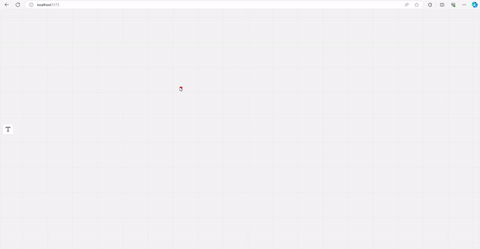

# Sugar Monorepo

**Note: This project is extremely in the early stages.**

Project provides `sugar-canvas-ui` library to build applications for HTML canvas.

It provides out of the box:

- Optimized Rendering, Components Tree
- Primitive components such as `RectangleComponent`, `TextComponent`
- Events handling like event propogation and collision detection

You can see the demo project, `sugar-whiteboard` that uses `sugar-canvas-ui` under the hood.

`sugar-whiteboard` and `sugar-canvas-ui` are both framework agnostic packages and it is used in the vue project.

You can follow the project development process in this public Trello board: https://trello.com/b/6WD3ReJt/sugar-whiteboard

I'm happy for any suggestions or contributions. Feel free to fork and create issues.
